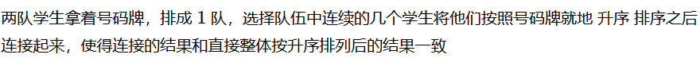

# 机考题库blog

## 【前后缀】学生最多分多少组

链接：https://codefun2000.com/p/P4525

华为-1204秋招

### 题目内容

### 题解思路

**核心思路**：切分点左边区间的最大值要不大于右边区间的最小值，遍历所有区分点，看有多少个区分点符合条件。

**暴力求解**：

1.外层遍历所有区分点（从0到n-2) ——O(n)

2.内层遍历左边区间和右边区间，得两个区间的最大最小值——O(n)

时间复杂度O(n^2) 空间复杂度O(1)

思考：内层遍历求最值的操作其实有很多重复性工作，如果能将遍历变成查找，将时间复杂度降为O(1)就好了。

​	比方说存储一个数组——表示前 i 个数的最大值，还有一个数组，后 n-i 个数的最小值，那内层就直接查找比较切分点对应索引的两个数组值就好了

这种“遍历转化为查找”的思路，就是**前后缀思想——空间换时间**

应用前后缀思路的核心：需要**重复遍历每个位置的左右区间**信息（最值、累和、累乘积）————转化为查询左右区间的信息数组（前缀 和数组 /前缀 最值数组 /后缀 累乘积数组）

可以用O(n)空间复杂度减小O(n)的时间复杂度

